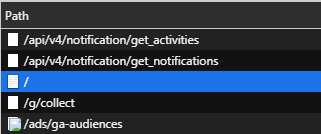
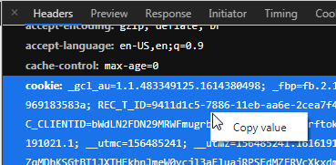

# Requirement
- Python 3.7.x

Download python di https://www.python.org/downloads/
# Setup
Install modul `requests` dengan perintah berikut
```sh
pip install requests
```
jika sudah, buka chrome dan buka https://shopee.co.id/ lalu login.
tekan F12 lalu masuk tab network.


refresh webpage dan cari item yang seperti berikut: `/`



klik item dan klik kanan pada header "cookie" didalam "Request headers"



lalu pilih `copy value`.

edit cookie.txt lalu paste dan save!

selesai/sudah siap login

jalankan scriptnya dengan perintah berikut
```
python main.py
```
